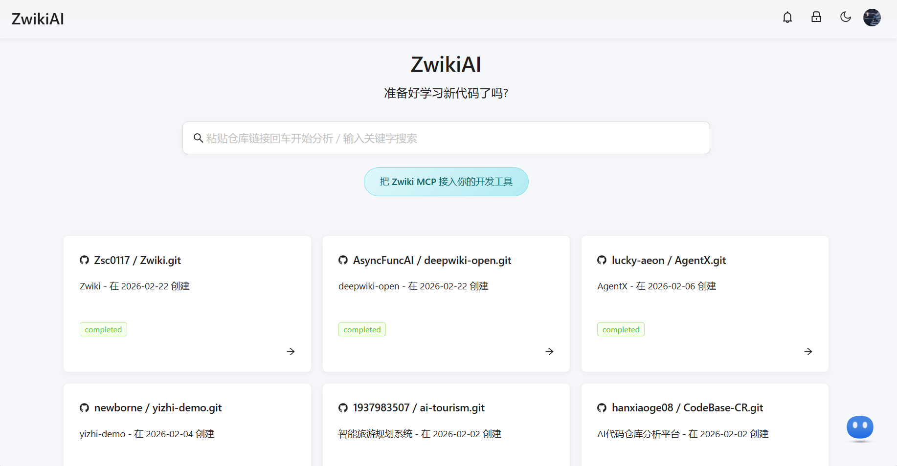
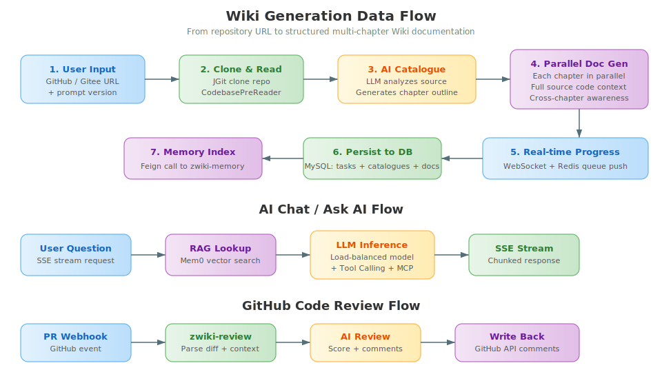
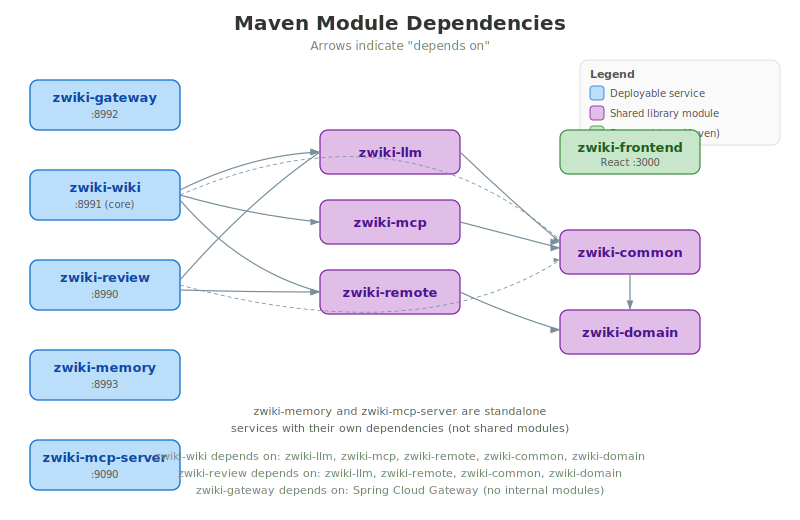
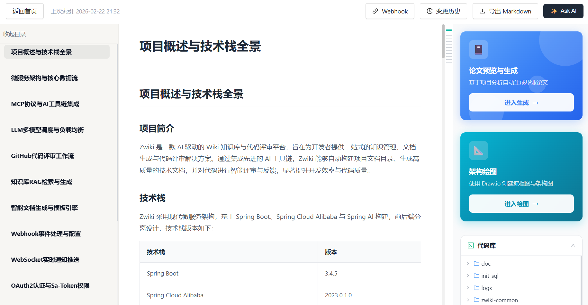
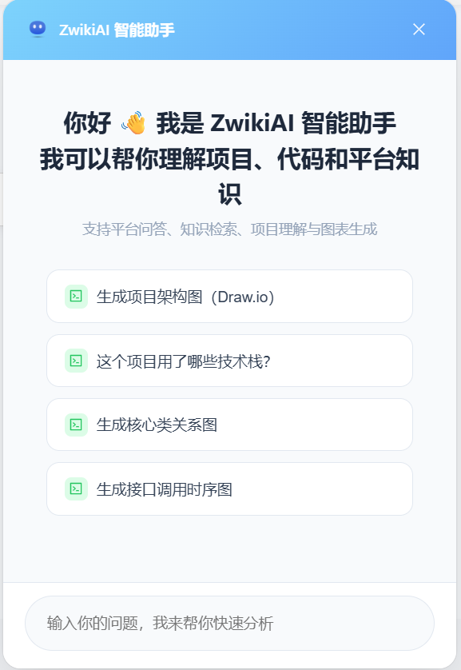
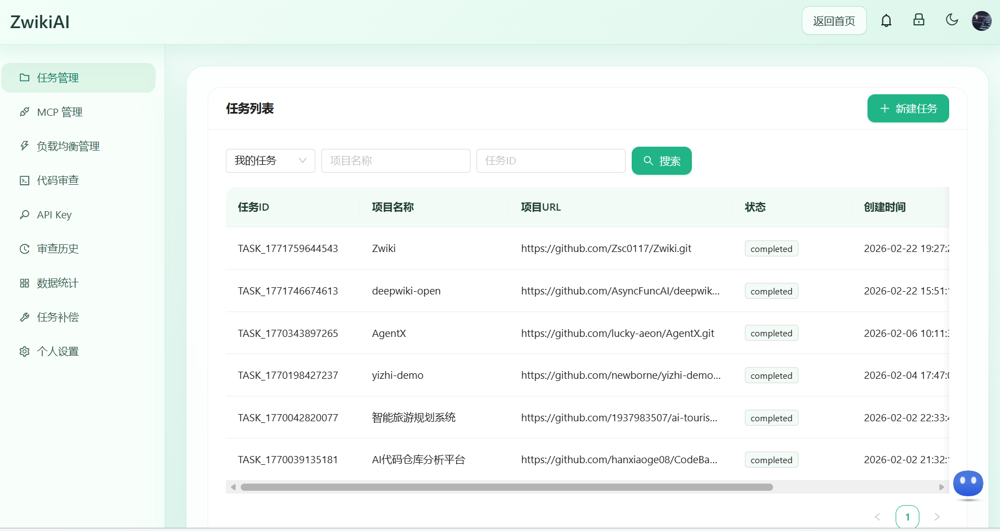
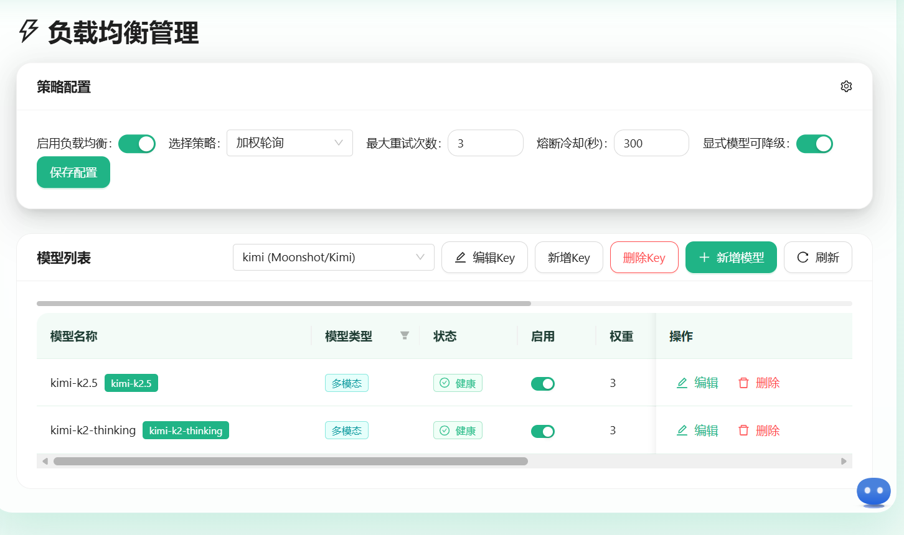
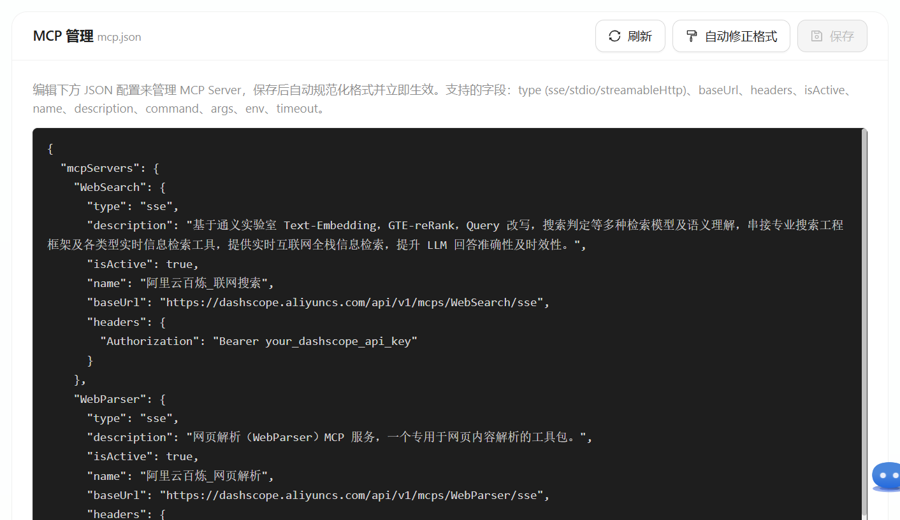

<p align="center">
  
</p>

<h1 align="center">ZwikiAI</h1>

<p align="center">
  <strong>AI 驱动的代码仓库 Wiki 文档自动生成 &amp; 智能问答平台</strong>
</p>

<p align="center">
  <a href="#-功能矩阵">功能矩阵</a> ·
  <a href="#-快速开始">快速开始</a> ·
  <a href="#-常见问题-faq">FAQ</a> ·
  <a href="#-开源路线图">路线图</a> ·
  <a href="CONTRIBUTING.md">贡献指南</a> ·
  <a href="SECURITY.md">安全策略</a>
</p>

<p align="center">
  
  
  
  
  
  
</p>

---

## 📸 项目预览

<p align="center">
  
</p>

<details>
<summary><b>🏗️ 系统架构总览（点击展开大图）</b></summary>
<br/>
<p align="center">
  
</p>
</details>

<details>
<summary><b>🔄 核心数据流（Wiki 生成 / AI 问答 / 代码审查）</b></summary>
<br/>
<p align="center">
  
</p>
</details>

<details>
<summary><b>📦 Maven 模块依赖关系</b></summary>
<br/>
<p align="center">
  
</p>
</details>


## 📖 项目概述

**ZwikiAI** 是一个基于 Spring Cloud Alibaba 微服务架构的 AI 平台，核心能力是将任意 GitHub/Gitee 代码仓库自动转化为结构化的 Wiki 技术文档，同时提供：

- **AI 文档生成** — 自动分析源代码，生成多章节 Wiki 文档（架构设计、模块详解、部署指南等）
- **AI 代码审查** — GitHub Webhook 自动触发 PR 审查，输出评分 + 逐文件评论
- **AI 智能问答** — 基于 RAG 的项目级 / 代码级对话，支持 SSE 流式输出
- **MCP Server** — 标准 Model Context Protocol 服务，让 Cursor / Windsurf / Claude 等 IDE 直接调用仓库阅读与文档检索能力
- **多模型负载均衡** — 支持 8 大 LLM Provider（DashScope、OpenAI、Azure、DeepSeek、Moonshot、MiniMax、Zhipu、Custom），自动熔断与重试

<p align="center">
  
</p>

---

## ✨ 功能特性

### 🔧 核心功能

| 功能 | 说明 |
|------|------|
| **Wiki 文档自动生成** | 输入仓库 URL → AI 分析源码 → 自动生成目录结构 → 并行生成各章节内容，支持实时进度推送 |
| **GitHub/Gitee 代码审查** | 配置 Webhook 后，PR 自动触发 AI 审查，输出总评 + 文件级评论，结果回写 GitHub |
| **项目智能问答 (Ask AI)** | 针对已分析项目进行上下文对话，支持 Tool Calling + MCP 工具调用 + RAG 增强 |
| **全局 AI 助手** | 悬浮聊天窗口，支持联网搜索、网页解析、天气查询、Draw.io 绘图等 MCP 工具 |
| **MCP Server** | 对外暴露 6 个标准 MCP 工具，可接入任何支持 MCP 的 IDE 客户端 |
| **论文/文档生成** | 交互式生成论文，支持多版本、反馈迭代、Word/Markdown 导出 |

<p align="center">
  
</p>

### 📊 平台能力

| 功能 | 说明 |
|------|------|
| **多 LLM Provider** | 支持 DashScope / OpenAI / Azure / DeepSeek / Moonshot / MiniMax / Zhipu / 自定义 |
| **模型负载均衡** | Round-Robin 轮询 + 自动熔断 + 健康检查 + 错误重试 |
| **按场景选模型** | 目录生成 / 文档生成 / 项目问答 / 智能助手 可分别指定模型 |
| **Token 用量统计** | 按模型 / Key / Provider 三维度统计，支持每日趋势图 |
| **OAuth 多端登录** | GitHub + Gitee OAuth2 登录，支持账号绑定 / 解绑 |
| **实时通知** | WebSocket 推送任务进度 + 邮件通知（QQ 邮箱） |
| **Wiki 自动更新** | 仓库 Push 事件 Webhook 自动触发文档增量更新 |
| **Draw.io 绘图** | AI 生成架构图 / ER 图 / 流程图，集成 draw.io 编辑器 |
| **代码浏览器** | 在线浏览项目文件树与源码 |
| **暗色模式** | 全站暗色主题切换 |

<p align="center">
  
  
</p>

---

## 🧭 功能矩阵

| 能力 | 免费自部署 | 依赖外部服务 | 是否核心路径 | 说明 |
|------|------------|--------------|--------------|------|
| Wiki 文档生成 | 是 | LLM | 是 | 输入仓库 URL 后自动生成多章节文档 |
| 项目问答 / Ask AI | 是 | LLM，可选 Memory | 是 | 支持 SSE 流式输出、RAG 增强 |
| GitHub 代码审查 | 是 | GitHub + LLM | 否 | 依赖 GitHub Webhook 与 PAT/OAuth |
| OAuth 登录 | 是 | GitHub / Gitee | 否 | 不启用时可自行扩展其他认证方式 |
| MCP Server | 是 | 无 | 否 | 面向 IDE 客户端开放标准协议能力 |
| Memory 检索增强 | 是 | Mem0 / 向量相关服务 | 否 | 可作为增强模块按需启用 |
| 邮件通知 | 是 | SMTP | 否 | 建议通过环境变量配置授权信息 |
| MinIO 媒体存储 | 是 | MinIO | 否 | 涉及文档导出或媒体资源时使用 |

---

## 🏗️ 系统架构

<p align="center">
  
</p>

> 更多图示：[数据流图](docs/assets/dataflow.svg) · [模块依赖图](docs/assets/module-deps.svg)

### 模块说明

| 模块 | 说明 | 端口 |
|------|------|------|
| `zwiki-frontend` | React 前端，Ant Design 5 组件库 | 3000 |
| `zwiki-gateway` | Spring Cloud Gateway 网关，路由 / CORS / 限流 | 8992 |
| `zwiki-wiki` | **核心服务** — Wiki 生成、AI 对话、OAuth 登录、任务管理、论文生成 | 8991 |
| `zwiki-review` | 代码审查服务 — GitHub Webhook 接收 + AI 审查 + 结果回写 | 8990 |
| `zwiki-memory` | 记忆服务 — 基于 Mem0 的代码仓库向量索引与检索 | 8993 |
| `zwiki-llm` | LLM 负载均衡模块（非独立服务） — 多模型轮询、熔断、重试 | — |
| `zwiki-mcp` | MCP 客户端模块（非独立服务） — SSE/Stdio MCP 连接管理 | — |
| `zwiki-mcp-server` | MCP Server — 对外暴露标准 MCP 协议的仓库阅读 / 文档检索工具 | 9090 |
| `zwiki-common` | 公共模块 — 异常处理、工具类、共享配置 | — |
| `zwiki-domain` | 领域模型 — 共享 DTO / Entity | — |
| `zwiki-remote` | 远程调用 — Feign Client 定义 | — |

---

## 🛠️ 技术栈

### 后端

| 技术 | 版本 | 用途 |
|------|------|------|
| Java | 21 | 运行时 |
| Spring Boot | 3.4.5 | 基础框架 |
| Spring Cloud | 2024.0.0 | 微服务 |
| Spring Cloud Alibaba | 2023.0.1.0 | Nacos 注册配置中心 |
| Spring AI | 1.0.0 | LLM 集成 |
| Spring AI Alibaba | 1.0.0.3 | DashScope / 百炼 |
| Spring Cloud Gateway | — | API 网关 |
| Spring Security + OAuth2 | — | 认证授权 |
| Sa-Token | 1.37.0 | 会话管理 |
| Spring Data JPA | — | ORM |
| Flyway | — | 数据库迁移 |
| Redis | — | 缓存 / Session / 消息队列 |
| MySQL | 8.0 | 持久化 |
| Nacos | — | 服务注册与配置中心 |
| Sentinel | — | 限流熔断 |
| JGit | 6.10.0 | Git 仓库克隆与操作 |
| Apache POI | 5.4.0 | Word 文档生成 |
| MinIO | — | 对象存储 |
| Hutool | 5.8.26 | 工具库 |
| Knife4j | 4.4.0 | API 文档 |

### 前端

| 技术 | 版本 | 用途 |
|------|------|------|
| React | 18.2 | UI 框架 |
| Ant Design | 5.x | 组件库 |
| Ant Design Pro Components | 2.4 | 高级组件 |
| React Router | 6.x | 路由 |
| Axios | 1.4 | HTTP 客户端 |
| Mermaid | 11.6 | 图表渲染 |
| Framer Motion | 10.x | 动画 |
| React Markdown | 10.1 | Markdown 渲染 |
| draw.io (embed) | — | 图表编辑器 |

---

## 🚀 快速开始

### 环境要求

| 依赖 | 最低版本 | 说明 |
|------|---------|------|
| **JDK** | 21 | 推荐 Eclipse Temurin |
| **Maven** | 3.9+ | 构建工具 |
| **Node.js** | 16+ | 前端构建 |
| **MySQL** | 8.0 | 数据库 |
| **Redis** | 6.0+ | 缓存与消息队列 |
| **Nacos** | 2.x | 服务注册配置中心（可选，本地开发有 Fallback） |

### 1. 克隆项目

```bash
git clone https://github.com/your-org/Zwiki.git
cd Zwiki
```

建议先复制根目录 `.env.example`，根据你的本地环境补齐数据库、Redis、OAuth、LLM 等配置项。

### 2. 初始化数据库

```bash
# 连接 MySQL，执行初始化脚本
mysql -u root -p < database-sql/init.sql
```

这会创建 `zwiki` 数据库和所有需要的表，并插入初始 LLM 模型配置数据。

### 3. 配置 LLM API Key

项目默认使用 **阿里云 DashScope**（百炼）作为 LLM 提供商。你需要准备至少一个 LLM API Key：

- 注册 [阿里云百炼](https://dashscope.aliyuncs.com/)，获取 API Key
- 或使用其他兼容 OpenAI 协议的提供商（OpenAI / DeepSeek / Moonshot 等）

在各服务的 `application.yml` 中配置（或通过环境变量覆盖）：

```yaml
spring:
  ai:
    openai:
      api-key: ${DASHSCOPE_API_KEY:your-api-key-here}
      base-url: https://dashscope.aliyuncs.com/compatible-mode
```

> 💡 也可以启动后在前端 **个人中心 → 负载均衡管理** 页面动态添加 Key 和模型。

### 4. 配置 OAuth 登录（可选但推荐）

项目支持 GitHub 和 Gitee OAuth 登录。

#### GitHub OAuth App

1. 前往 [GitHub Developer Settings](https://github.com/settings/developers) 创建 OAuth App
2. **Homepage URL**: `http://localhost:3000`
3. **Authorization callback URL**: `http://localhost:8991/login/oauth2/code/github`
4. 获取 Client ID 和 Client Secret

#### Gitee OAuth App

1. 前往 [Gitee 第三方应用](https://gitee.com/oauth/applications) 创建应用
2. **应用回调地址**: `http://localhost:8991/login/oauth2/code/gitee`
3. 获取 Client ID 和 Client Secret

在 `zwiki-wiki` 的配置中设置：

```yaml
spring:
  security:
    oauth2:
      client:
        registration:
          github:
            client-id: ${GITHUB_CLIENT_ID}
            client-secret: ${GITHUB_CLIENT_SECRET}
          gitee:
            client-id: ${GITEE_CLIENT_ID}
            client-secret: ${GITEE_CLIENT_SECRET}
```

### 5. 配置中间件连接

修改 `zwiki-wiki/src/main/resources/application.yml`（其他服务类似）：

```yaml
spring:
  datasource:
    url: jdbc:mysql://127.0.0.1:3306/zwiki?useUnicode=true&characterEncoding=utf8&useSSL=false&serverTimezone=Asia/Shanghai&allowPublicKeyRetrieval=true
    username: root
    password: your-mysql-password

  data:
    redis:
      host: 127.0.0.1
      port: 6379
      password: your-redis-password
```

### 6. 构建与启动后端

```bash
# 编译全部模块
mvn clean install -DskipTests

# 按顺序启动各服务（各自在独立终端中运行）

# 1. 网关服务
java -jar zwiki-gateway/target/zwiki-gateway-1.0.0-SNAPSHOT.jar

# 2. Wiki 核心服务（必须）
java -jar zwiki-wiki/target/zwiki-wiki-1.0.0-SNAPSHOT.jar

# 3. 代码审查服务（可选）
java -jar zwiki-review/target/zwiki-review-1.0.0-SNAPSHOT.jar

# 4. 记忆服务（可选）
java -jar zwiki-memory/target/zwiki-memory-1.0.0-SNAPSHOT.jar

# 5. MCP Server（可选）
java -jar zwiki-mcp-server/target/zwiki-mcp-server-1.0.0-SNAPSHOT.jar
```

> 💡 **最小启动**：只需 `zwiki-gateway` + `zwiki-wiki` + MySQL + Redis 即可使用核心的 Wiki 生成和 AI 对话功能。

### 7. 启动前端

```bash
cd zwiki-frontend
npm install
npm start
```

前端默认运行在 `http://localhost:3000`，通过 CRA proxy 转发 API 请求到网关 `http://localhost:8992`。

### 8. 访问

打开浏览器访问 `http://localhost:3000`，使用 GitHub 或 Gitee 账号登录即可。

---

## ⚙️ 配置参考

### 环境变量速查

| 环境变量 | 默认值 | 说明 |
|---------|--------|------|
| `DASHSCOPE_API_KEY` | — | DashScope API Key |
| `GITHUB_CLIENT_ID` | — | GitHub OAuth Client ID |
| `GITHUB_CLIENT_SECRET` | — | GitHub OAuth Client Secret |
| `GITEE_CLIENT_ID` | — | Gitee OAuth Client ID |
| `GITEE_CLIENT_SECRET` | — | Gitee OAuth Client Secret |
| `GITHUB_TOKEN` | — | GitHub 代码审查用的 PAT |
| `GITHUB_WEBHOOK_SECRET` | — | GitHub Webhook 签名密钥 |
| `PROJECT_REPO_PATH` | `./data/repositories` | 仓库克隆本地存储路径 |
| `ZWIKI_REDIS_HOST` | `127.0.0.1` | Redis 地址 |
| `ZWIKI_REDIS_PORT` | `6379` | Redis 端口 |
| `ZWIKI_REDIS_PASSWORD` | — | Redis 密码 |
| `GIT_PROXY_ENABLED` | `false` | 是否启用 Git 代理 |
| `GIT_PROXY_HOST` | `127.0.0.1` | Git 代理地址 |
| `GIT_PROXY_PORT` | `7897` | Git 代理端口 |
| `MAIL_ENABLED` | `false` | 是否启用邮件通知 |
| `ZWIKI_MCP_API_KEYS` | — | MCP Server API Key |

> ⚠️ 开源仓库中的所有配置文件均应只保留占位符，切勿将真实 API Key、OAuth Secret、Webhook Secret、邮件授权码等敏感信息提交到 Git 历史中。

### 服务端口

| 服务 | 端口 |
|------|------|
| Frontend | 3000 |
| Gateway | 8992 |
| Wiki Service | 8991 |
| Review Service | 8990 |
| Memory Service | 8993 |
| MCP Server | 9090 |

### Nacos 配置（可选）

如果使用 Nacos 作为配置中心，需要在 Nacos 中创建以下配置文件：

- `zwiki-wiki-service-dev.yaml`
- `zwiki-review-service-dev.yaml`
- `zwiki-memory-service-dev.yaml`
- `zwiki-gateway-service-dev.yaml`

参考模板在 `database-sql/` 目录下。

> 💡 不使用 Nacos 时，各服务会自动回退到本地 `application.yml` 中的 Fallback 配置。

---

## 🔐 安全声明

- 本仓库的配置文件应只保留占位符，不应提交真实密钥
- 发布到 GitHub 前，建议再次检查工作区和 Git 历史中是否存在泄露凭据
- 如发现安全问题，请优先阅读并遵循 [`SECURITY.md`](SECURITY.md)
- 若你使用 Fork 继续开发，请在自己的部署环境中重新生成所有密钥与 Secret

---

## 🔗 第三方依赖服务说明

项目支持按需启用第三方服务，常见依赖如下：

| 服务 | 是否必需 | 用途 | 说明 |
|------|----------|------|------|
| MySQL | 是 | 主数据存储 | 核心业务表、配置表、文档数据 |
| Redis | 是 | 缓存 / Session / 队列 | 核心运行依赖 |
| LLM Provider | 是 | 文档生成 / 问答 / 审查 | 默认示例为 DashScope，也可替换为兼容 OpenAI 协议的服务 |
| Nacos | 否 | 配置中心 / 注册中心 | 不使用时可退回本地配置 |
| GitHub / Gitee OAuth | 否 | 登录认证 | 本地开发可先不启用 |
| GitHub Webhook | 否 | 代码审查自动触发 | 仅 review 模块需要 |
| Mem0 / 向量相关服务 | 否 | 检索增强 | 作为增强能力按需开启 |
| MinIO | 否 | 对象存储 | 媒体资源或导出类场景使用 |
| SMTP | 否 | 邮件通知 | 可完全关闭 |

---

## 🔌 MCP Server 接入

ZwikiAI 提供标准 MCP Server，支持 Cursor / Windsurf / Claude Code 等 IDE 接入。

<p align="center">
  
</p>

### 提供的 MCP 工具

| 工具 | 说明 |
|------|------|
| `list_projects` | 列出所有已分析的项目 |
| `search_wiki` | 全文搜索 Wiki 文档 |
| `get_repo_structure` | 获取项目文件树 |
| `read_file` | 读取项目源文件 |
| `get_wiki_document` | 获取生成的 Wiki 文档内容 |
| `get_project_report` | 获取项目分析报告 |

### 客户端配置示例

```json
{
  "mcpServers": {
    "zwiki": {
      "url": "http://localhost:9090/sse",
      "headers": {
        "Authorization": "Bearer your_api_key"
      }
    }
  }
}
```

---

## 📁 项目结构

```
Zwiki/
├── zwiki-frontend/          # React 前端
│   ├── src/
│   │   ├── api/             # API 调用层
│   │   ├── auth/            # OAuth 认证上下文
│   │   ├── components/      # 通用组件（ChatWidget、DrawioEditor 等）
│   │   ├── pages/           # 页面组件
│   │   └── App.jsx          # 路由入口
│   └── package.json
├── zwiki-gateway/           # Spring Cloud Gateway 网关
├── zwiki-wiki/              # Wiki 核心服务
│   └── src/main/java/com/zwiki/
│       ├── controller/      # REST API（24 个 Controller）
│       ├── service/         # 业务逻辑
│       ├── auth/            # OAuth + Sa-Token 认证
│       ├── config/          # 配置类
│       ├── queue/           # Redis 消息队列消费者
│       ├── thesis/          # 论文生成模块
│       └── websocket/       # WebSocket 通知推送
├── zwiki-review/            # AI 代码审查服务
├── zwiki-memory/            # Mem0 记忆/向量检索服务
├── zwiki-llm/               # LLM 负载均衡模块
├── zwiki-mcp/               # MCP 客户端模块
├── zwiki-mcp-server/        # MCP Server（独立微服务）
├── zwiki-common/            # 公共模块
├── zwiki-domain/            # 领域模型
├── zwiki-remote/            # Feign 远程调用
├── database-sql/            # 数据库初始化脚本 + Nacos 配置模板
├── mcp.json                 # MCP Server 配置
└── pom.xml                  # Maven 父 POM
```

---

## ❓ 常见问题 FAQ

### 1. 最小可运行组合是什么？

最小可运行组合为：

- `zwiki-gateway`
- `zwiki-wiki`
- MySQL
- Redis
- 前端 `zwiki-frontend`

如果你只想先体验核心的 Wiki 生成和项目问答，这套组合就足够。

### 2. 不接入 Nacos 可以运行吗？

可以。当前项目支持在 Nacos 不可用时回退到本地 `application.yml` 配置。

### 3. 不配置 OAuth 可以运行吗？

可以先进行本地开发和接口联调，但完整登录流程依赖 GitHub / Gitee OAuth 配置。

### 4. Memory / Review / MCP Server 必须一起启吗？

不是。它们都可以按需启用：

- `zwiki-memory`：用于增强检索与记忆能力
- `zwiki-review`：用于 GitHub PR 代码审查
- `zwiki-mcp-server`：用于 IDE 接入 MCP 能力

### 5. 为什么开源仓库里没有真实配置？

这是出于安全考虑。你需要参考 `.env.example` 和 `database-sql/` 中的模板，在自己的环境中填入真实配置。

### 6. 当前有官方 `docker-compose.yml` 吗？

当前仓库**暂不提供**官方 `docker-compose.yml`。
请优先参考 `README.md` 与 `docs/DEPLOYMENT.md` 中的手动启动说明完成本地或服务器部署。

---

## 🗺️ 开源路线图

- [x] 系统架构图、数据流图、模块依赖图
- [ ] 补充首页截图与功能演示 GIF
- [ ] 提供 docker-compose 本地一键启动方案
- [x] 增加最小 CI 检查与自动化构建流程
- [ ] 增加更多示例数据与演示仓库
- [ ] 持续完善 Memory / MCP / Review 模块文档

---

## ⚠️ 已知限制

- 微服务较多，首次接入成本高于单体项目
- 部分高级能力依赖外部 LLM、OAuth、Webhook 或向量服务
- 本地启动虽然支持 Fallback 配置，但完整功能链路仍建议准备 MySQL、Redis 与至少一个 LLM Provider
- 不同 Provider 对流式输出、Token Usage、工具调用支持程度不完全一致

---

## 🤝 贡献指南

如果你希望参与项目贡献，请先阅读：

- [`CONTRIBUTING.md`](CONTRIBUTING.md)
- [`CODE_OF_CONDUCT.md`](CODE_OF_CONDUCT.md)
- [`SECURITY.md`](SECURITY.md)

GitHub 社区模板已包含：

- Bug 报告模板
- 功能建议模板
- 问题咨询模板
- Pull Request 模板

---

## 📄 License

本项目基于 [MIT License](LICENSE) 开源。

---

## 📚 更多文档

| 文档 | 说明 |
|------|------|
| [本地开发指南](docs/LOCAL_DEV.md) | 从零搭建本地开发环境 |
| [部署指南](docs/DEPLOYMENT.md) | 服务器 / 生产环境部署 |
| [GitHub Webhook 配置](docs/GitHub-Webhook配置指南.md) | 代码审查 Webhook 接入 |
| [MCP Server 文档](zwiki-mcp-server/README.md) | MCP 协议接入详细说明 |
| [前端文档](zwiki-frontend/README.md) | 前端开发与构建说明 |
| [贡献指南](CONTRIBUTING.md) | 如何参与项目贡献 |
| [安全策略](SECURITY.md) | 安全漏洞报告与规范 |

---

<p align="center">
  <strong>⭐ 如果这个项目对你有帮助，请给一个 Star！</strong>
</p>
